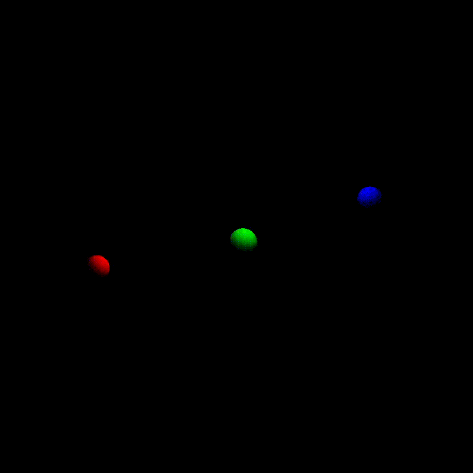

# 太极图形课S1-作业1：三体仿真系统


## 背景简介
本文以N-body仿真代码为基础，实现了一个简单的稳定三体系统。

## 成功效果展示
这里可以展示这份作业（项目）run起来后的可视化效果，可以让其他人更直观感受到你的工作


## 整体结构（Optional）
```
├── data
│   └── three_body_simulation.gif
├── imgui.ini
├── LICENSE
├── README.md
├── requirements.txt
└── three_body_simulation.py
```

## 运行方式
运行环境：
```bash
[Taichi] version 0.7.32, llvm 10.0.0, commit 1f63a960, linux, python 3.8.10
[Taichi] Starting on arch=cuda
```
依赖：**GGUI**

直接运行： `python3 three_body_simulation.py`
